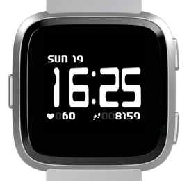

# CPU

Digital clock face for Fitbit Versa, inspired by retro computer ads. Currently in early development.

## Current Features

* Time (12 / 24 hr)
* Day and date
* Heart rate
* Step count

## Planned Features

* Weather
* Other activity stats (configurable)
* Heart rate animation

## Acknowledgements

This project was started from the [Fitbit/sdk-lcd-clock](https://github.com/Fitbit/sdk-lcd-clock) example, as of [commit 8f19795](https://github.com/Fitbit/sdk-lcd-clock/commit/8f19795141c284c79df3fa03841c2d6480520b53).

The clock numerals are based on the [Chintzy CPU](https://www.fontspace.com/%C3%A6nigma-fonts/chintzy-cpu-brk) font. All other text uses [Quantifier](https://www.fontspace.com/total-fontgeek-dtf-ltd/quantifier-nbp).

Heart rate readings and animation are based on [KiezelPay/Fitbit_Realistic_HRM](https://github.com/KiezelPay/Fitbit_Realistic_HRM) as of [commit 14c5f52](https://github.com/KiezelPay/Fitbit_Realistic_HRM/commit/14c5f525cc881ae971ddfe3a906979692d7622a4).